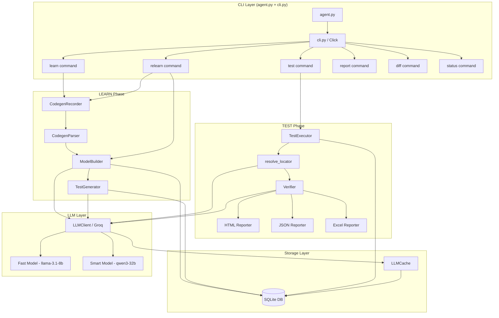
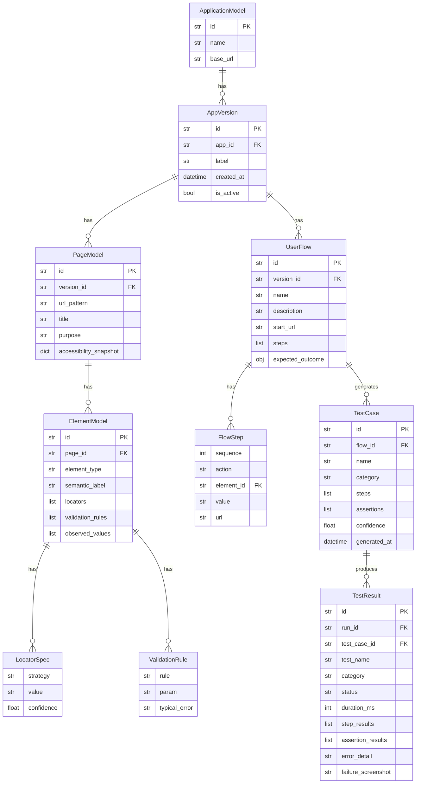
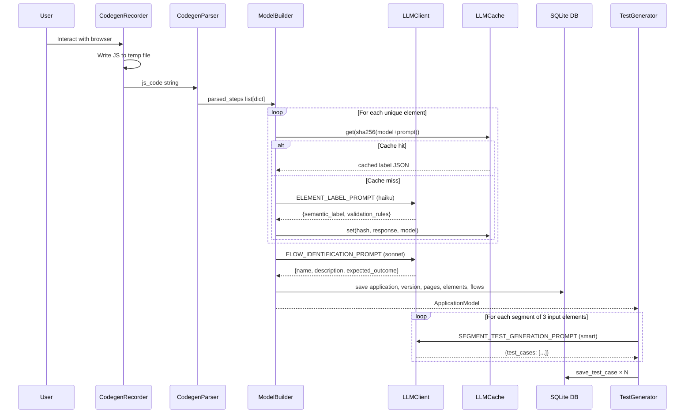
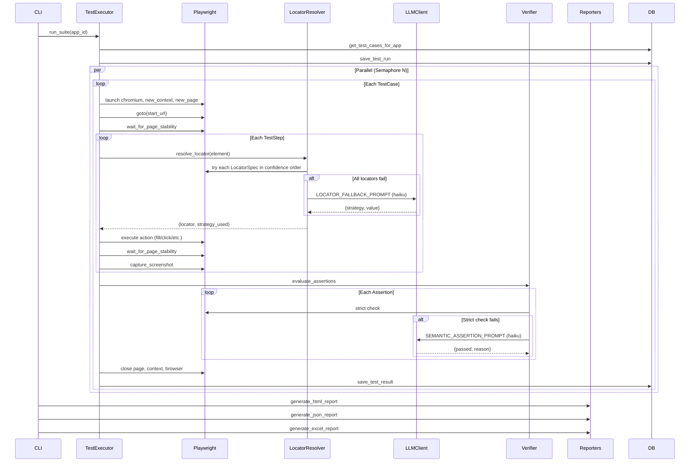

# Design Document — Browser Agent: Project Index and Analysis

## Overview

The Browser Agent is an AI-powered, Python-based functional testing tool that operates in two distinct phases:

- **LEARN phase**: A user records a browser session. The system converts the recording into a structured `ApplicationModel` (pages, elements, flows), persists it to SQLite, and generates a comprehensive suite of test cases using LLM-driven mutation.
- **TEST phase**: The system autonomously replays each test case using Playwright, resolves UI elements via a multi-strategy locator chain (with LLM fallback), evaluates assertions (with LLM semantic healing), and produces HTML, JSON, and Excel reports.

The system is entirely local: a single SQLite file holds all domain data, LLM response cache, and test results. All external API calls go to the Groq inference API using a two-tier model strategy (fast model for high-volume labelling, smart model for high-reasoning tasks).

### Key Design Goals

1. **Zero-maintenance locators** — The codegen recorder captures Playwright's native `getByRole`/`getByLabel` locators, which are far more resilient to DOM changes than CSS selectors.
2. **LLM as co-pilot, not driver** — The LLM is called for semantic labelling, flow naming, test mutation, locator fallback, and assertion healing. All critical execution paths have deterministic fallbacks.
3. **Cost efficiency** — Every LLM call is SHA-256 keyed and cached in SQLite. Repeated learn/test runs against unchanged pages cost zero API tokens.
4. **Single-file deployment** — All state, cache, and test artefacts live in one directory. No external services, no databases to provision.


---

## Architecture

The system follows a unidirectional data flow with two clear execution modes:

```
┌────────────────────────────────────────────────────────────────────┐
│                          LEARN PHASE                               │
├────────────────────────────────────────────────────────────────────┤
│                                                                    │
│  Playwright Codegen  →  CodegenParser  →  ModelBuilder            │
│       (User)              (Regex)          (LLM + DB)              │
│                                                                    │
│  ┌──────────┐       ┌──────────┐       ┌──────────────────┐      │
│  │ .js file │   →   │ Parsed   │   →   │ ApplicationModel │      │
│  │ output   │       │ steps    │       │ (persisted)      │      │
│  └──────────┘       └──────────┘       └──────────────────┘      │
│                                               ↓                    │
│                                        TestGenerator               │
│                                          (LLM-driven)              │
│                                               ↓                    │
│                                        TestCase objects            │
│                                        (persisted to DB)           │
└────────────────────────────────────────────────────────────────────┘

┌────────────────────────────────────────────────────────────────────┐
│                          TEST PHASE                                │
├────────────────────────────────────────────────────────────────────┤
│                                                                    │
│  TestExecutor (Playwright)  →  LocatorResolver  →  Verifier       │
│                                  (Multi-strategy)    (LLM healing) │
│                                                                    │
│  ┌──────────┐       ┌──────────┐       ┌──────────────────┐      │
│  │ TestCase │   →   │ Resolved │   →   │  Assertion       │      │
│  │ objects  │       │ locators │       │  results         │      │
│  └──────────┘       └──────────┘       └──────────────────┘      │
│                                               ↓                    │
│                                        Reporters                   │
│                                        (HTML/JSON/Excel)           │
│                                               ↓                    │
│                                        Test artefacts              │
└────────────────────────────────────────────────────────────────────┘
```


### System Architecture Diagram




---

## Components and Interfaces

### Entry Point: agent.py

The top-level entry point. Its sole responsibilities are:

1. Insert `browser_agent/` onto `sys.path` so all sub-packages resolve without package installation.
2. On `win32`, reconfigure `sys.stdout` and `sys.stderr` to `utf-8` before any Rich output.
3. Delegate to `cli.cli` via Click.

**Interface:** `python agent.py [COMMAND] [OPTIONS]`

---

### CLI Layer: cli.py

Built with Click. Exposes six commands:

| Command   | Description                                                               |
|-----------|---------------------------------------------------------------------------|
| `learn`   | Record a session via Playwright codegen, build model, generate test cases |
| `test`    | Execute all (or filtered) test cases for an app, generate reports         |
| `relearn` | Re-record using raw BrowserRecorder, diff, optionally activate new version |
| `report`  | Open the most recent HTML or Excel report                                 |
| `diff`    | Compare two named version labels for structural changes                   |
| `status`  | List all registered apps with version, last run date, and pass rate       |

The `learn` command uses `CodegenRecorder` (the preferred path). The `relearn` command uses the legacy `BrowserRecorder` (raw JS injection). Both paths converge at `ModelBuilder`.

**Initialisation invariant:** Every command that touches the DB calls `await db.initialize()` before any DB operation.

---

### Configuration: config.py

`Config` is a class with class-level attributes, loaded once at module import time via `python-dotenv`. All integer parameters are coerced with `int()`; a non-integer environment value raises `ValueError` at startup.

| Parameter             | Default                          | Type   |
|-----------------------|----------------------------------|--------|
| `GROQ_API_KEY`        | `""`                             | str    |
| `DB_PATH`             | `./browser_agent.db`             | str    |
| `SCREENSHOTS_DIR`     | `./screenshots`                  | str    |
| `REPORTS_DIR`         | `./reports`                      | str    |
| `LLM_CACHE_DIR`       | `./llm_cache`                    | str    |
| `GROQ_SMART_MODEL`    | `qwen/qwen3-32b`                 | str    |
| `GROQ_FAST_MODEL`     | `llama-3.1-8b-instant`           | str    |
| `MAX_LLM_RETRIES`     | `3`                              | int    |
| `LOCATOR_TIMEOUT_MS`  | `3000`                           | int    |
| `NAVIGATION_TIMEOUT_MS` | `10000`                        | int    |
| `PARALLEL_TESTS`      | `4`                              | int    |

**Design note:** `LLMClient` reads `GROQ_SMART_MODEL` and `GROQ_FAST_MODEL` independently from the environment (not from `Config`) to keep the LLM layer self-contained.


---

### LEARN Phase Components

#### BrowserRecorder (core/recorder.py)

The legacy, raw-event recorder. Used only by `relearn`.

**Mechanism:**
1. Launches a headful Chromium browser (`headless=False`).
2. Registers `framenavigated`, `dialog`, and `request` event hooks.
3. Calls `context.add_init_script(event_capture_js)` so the JS runs on every future navigation automatically.
4. Explicitly injects `event_capture.js` into the first page via `page.evaluate()`.
5. Polls `window.__capturedEvents` every 500 ms, drains to `_event_buffer`, and clears the window buffer.
6. On navigation: captures URL, title, accessibility snapshot, and screenshot.
7. Auto-dismisses dialogs via `dialog.dismiss()`.
8. Logs only `/api/` requests.
9. On `stop_session()`: performs one final drain, closes the browser, returns a session dict.

**Output interface:**
```python
{
    "events": list[dict],         # raw captured events
    "navigations": list[dict],    # per-page navigation records
    "dialogs": list[dict],        # auto-dismissed dialogs
    "api_calls": list[dict],      # filtered /api/ requests
    "app_name": str,
    "start_url": str,
    "recorded_at": str            # ISO datetime
}
```

---

#### event_capture.js (assets/event_capture.js)

An IIFE injected into every page. Responsibilities:

1. Initialises `window.__capturedEvents = []` on every injection (allows re-injection).
2. Sets `window.__listenersAttached = true` on first injection to prevent duplicate listener registration.
3. Attaches capture-phase listeners for `click`, `input`, `change`, `submit`.
4. Each handler extracts: `tag`, `type_attr`, `id`, `name`, `placeholder`, `aria_label`, `role`, `text_content`, `value` (form controls only), `classes` (first 5), `event_type`, `timestamp` (ms since epoch), `page_url`.
5. Silently swallows all exceptions — never throws.

---

#### CodegenRecorder (core/codegen_recorder.py)

The preferred recorder. Delegates to Playwright's built-in codegen.

**Mechanism:**
1. Creates a temp `.js` file.
2. Runs `python -m playwright codegen --target javascript --output <temp_file> <start_url>` as a subprocess.
3. Blocks until the subprocess exits (user closes the browser).
4. Reads and returns the temp file content.
5. Deletes the temp file in a `finally` block.

**Rationale:** Playwright codegen produces `getByRole`, `getByLabel`, `getByPlaceholder` locators that are tied to semantic HTML attributes rather than DOM structure. These survive minor DOM refactors far better than CSS/XPath selectors.

---

#### CodegenParser (core/codegen_parser.py)

A pure regex parser. Converts Playwright JS into structured step dicts. No dependencies on Playwright itself.

**Parsed patterns (in match order):**

| Pattern | Resulting `locator_type` | Notes |
|---------|--------------------------|-------|
| `page.goto('url')` | `navigate` | Extracts URL |
| `page.getByRole('role', { name: '...' })` | `role` | Extracts role + name |
| `page.getByRole('role')` (no name) | `role` | `name` set to `None` |
| `page.locator('#id').getByRole('role')` | `chained_css_role` | Strips `#` from outer selector |
| `page.locator('selector')` | `id` / `xpath` / `css` | Classified by prefix |
| `page.getByText('text')` | `text` | |
| `page.getByLabel('label')` | `aria_label` | |
| `page.getByPlaceholder('ph')` | `placeholder` | |

`.first()` → `nth=0`; `.nth(N)` → `nth=N`.

**Design decision:** Regex parsing over AST parsing was chosen for simplicity and zero extra dependencies. The regex coverage is sufficient for all patterns emitted by `playwright codegen --target javascript`.


---

#### ModelBuilder (core/model_builder.py)

Converts raw session data or parsed codegen steps into a fully persisted `ApplicationModel`. Supports two entry points:

| Entry point | Input | Recording path |
|---|---|---|
| `build(session_data, ...)` | BrowserRecorder output dict | Raw JS events (legacy) |
| `build_from_codegen(parsed_steps, ...)` | CodegenParser output list | Codegen (preferred) |

**Build algorithm (codegen path):**

```
1. Reuse or create Application record (dedup by name)
2. Create AppVersion (label: v1_YYYY-MM-DD)
3. Walk navigate steps → create PageModel per unique URL
4. Walk action steps → per element:
   a. Compute dedup key (_codegen_step_key)
   b. Generate LocatorSpec list (_codegen_step_to_locators)
   c. Call LLM (haiku) with ELEMENT_LABEL_PROMPT → semantic_label + validation_rules
   d. Create ElementModel and append
   e. 200ms asyncio.sleep between LLM calls (rate limit guard)
5. Build FlowStep list by matching action steps to ElementModels
6. Call LLM (sonnet) with FLOW_IDENTIFICATION_PROMPT → flow name/description/expected_outcome
7. Assemble UserFlow
8. Persist everything: application, version, pages, elements, flows
9. If re-learning: call set_active_version to mark new version as active
10. Return ApplicationModel
```

**Deduplication keys (codegen path):**

| `locator_type` | Key format |
|---|---|
| `role` | `role\|{role}\|{name}\|{nth}` |
| `id` / `css` / `xpath` | `{type}\|{selector}\|{nth}` |
| `text` | `text\|{text}\|{nth}` |
| `aria_label` / `placeholder` | `{type}\|{name}\|{nth}` |
| `chained_css_role` | `chained\|{selector}\|{role}\|{name}\|{nth}` |

**LLM usage in ModelBuilder:**
- `ELEMENT_LABEL_PROMPT` → `haiku` model (fast) — called once per unique element
- `FLOW_IDENTIFICATION_PROMPT` → `sonnet` model (smart) — called once per flow

---

#### TestGenerator (core/test_generator.py)

Generates `TestCase` objects from a `UserFlow`. Produces:
- 1 `happy_path` test (built deterministically, no LLM)
- N `negative` + `edge_case` tests (LLM-driven, segment-based)

**Happy path construction:**
1. Removes redundant consecutive `click`+`fill` pairs on the same element from flow steps.
2. Re-indexes sequence numbers from 1.
3. Derives assertions from `flow.expected_outcome`.

**Segment-based LLM generation:**
1. Identifies "input-like" elements (`textbox`, `textarea`, `combobox`, `checkbox`, `input`, `password`, `select`).
2. Splits input elements into segments of 3.
3. For each segment: calls `SEGMENT_TEST_GENERATION_PROMPT` with the `smart` model alias, applying a **15-second delay between API calls** to respect Groq's 30 RPM limit.
4. LLM returns `target_element_id` + `mutated_value` pairs.
5. TestGenerator reconstructs test steps programmatically from the happy path, replacing only the target element's value.
6. For login-field tests: the test sequence is cut short after the login-button click.
7. Deduplicates by `(element_id, value)` fingerprint tuple.

**Design rationale:** Reconstructing steps from the happy path (rather than letting the LLM write full step lists) ensures structural correctness — the LLM only specifies what to mutate, not how to navigate.


---

### TEST Phase Components

#### TestExecutor (core/executor.py)

Autonomous Playwright-based runner.

**Concurrency model:**
```
run_suite()
  ├─ asyncio.Semaphore(PARALLEL_TESTS)        # default 4
  ├─ asyncio.gather(*tasks)                   # all tests fan out
  └─ Each test: fresh browser + context + page (isolated)
```

**Per-test lifecycle:**
```
1. Launch chromium (headless or visible)
2. Navigate to start_url → wait_for_page_stability
3. For each TestStep:
   a. navigate: goto + wait_for_page_stability
   b. other: resolve_locator → _execute_action → wait_for_page_stability
   c. On ElementNotFoundError: capture screenshot, status="failed", stop
   d. On other exception: capture screenshot, status="errored", stop
4. Evaluate assertions (if not errored)
5. Save TestResult to DB
6. Close page, context, browser (finally block — always runs)
```

**Page stability strategy (`wait_for_page_stability`):**
Three sequential layers, all non-blocking and exception-safe:
1. `document.readyState === 'complete'` (max 30 s)
2. `wait_for_load_state("networkidle")` (capped at 10 s — avoids blocking on WebSocket/long-polling apps)
3. Per-selector disappearance of known spinner/overlay selectors (max 15 s each)

**`_execute_action` supported actions:**

| Action | Playwright call |
|---|---|
| `fill` | Remove `readonly` attr → click → `.fill(value)` |
| `click` | `.click()` |
| `check` | `.check()` |
| `select` | `.select_option(value)` |
| `hover` | `.hover()` |
| `clear` | `.clear()` |
| *(default)* | `.click()` |

The `readonly` removal is a defensive measure for apps that mark inputs readonly before JavaScript initialisation completes.

---

#### Locator Resolution (utils/locators.py)

The multi-strategy locator chain is the critical resilience mechanism of the TEST phase.

**Resolution algorithm:**
```
resolve_locator(page, element, llm_client, timeout_ms=3000):
  1. Sort element.locators by confidence (descending)
  2. For each LocatorSpec:
     a. Build Playwright locator via _build_playwright_locator()
     b. Call .first.wait_for(state="visible", timeout=timeout_ms)
     c. On success: return (locator, strategy_name)
     d. On failure: continue to next spec
  3. If all fail: LLM fallback
     a. Capture accessibility.snapshot()
     b. Call LOCATOR_FALLBACK_PROMPT (haiku model)
     c. Build locator from LLM response
     d. wait_for(state="visible")
     e. On success: return (locator, "llm_fallback")
     f. On failure: raise ElementNotFoundError
```

**Locator strategy priority (confidence scores):**

| Strategy | Confidence | Playwright API |
|---|---|---|
| `aria_label` | 0.95 | `page.get_by_label(value)` |
| `chained_css_role` | 0.90 | `page.locator('#outer').getByRole(role, name=name)` |
| `placeholder` | 0.85 | `page.get_by_placeholder(value)` |
| `role` | 0.80–0.90 | `page.get_by_role(role, name=name)` |
| `id` | 0.70 | `page.locator('#value')` |
| `css_name` | 0.55 | `page.locator('tag[name="X"]')` |
| `xpath_text` | 0.40 | `page.locator('//tag[contains(text(),"X")]')` |
| `text` | 0.40 | `page.get_by_text(value)` |

**`::nth=N` suffix protocol:** When a locator value contains `::nth=N`, `_build_playwright_locator` strips the suffix and calls `.nth(N)` on the resolved locator. This prevents Playwright's strict-mode exception when multiple identical elements exist on a page.

**Auto-generated ID filtering:** IDs matching purely numeric, UUID-like, `react-` or `ember-` prefixed patterns are discarded at generation time and never stored as locators.


---

#### Assertion Verifier (core/verifier.py)

Evaluates `Assertion` objects against the live Playwright page. Two-layer design: strict check → LLM semantic healing.

**Assertion types:**

| Type | Strict Check | Notes |
|---|---|---|
| `url_contains` | `assertion.expected in page.url` | Waits up to 5 s for URL to match; special handling for login redirect |
| `element_visible` | `locator.first.wait_for(state="visible", timeout=15000)` | Tries element locators → `text=` → `get_by_label` |
| `text_equals` | `selector:::text` split; `locator.text_content()` == expected | Falls back to `get_by_text(exact=True)` |
| `element_count` | `selector:::count` split; `locator.count()` == int(count) | |
| `element_absent` | `locator.wait_for(state="hidden")` | |

**LLM semantic healing (`_evaluate_semantic_fallback`):**

Triggered when any strict check fails and `llm_client` is provided.

```
1. Capture toast text:
   a. Try .toast-title + .toast-message (structured, preferred)
   b. Fall back to [role='alert'], .alert, .notification, .toast
   c. Clean symbol-only lines with unicodedata.category check
2. Scrape body text (up to 4000 chars) for text/visibility assertions
3. Build SEMANTIC_ASSERTION_PROMPT
4. Call LLM (haiku model) → {"passed": bool, "reason": str}
5. If passed=true: mark assertion passed, set actual="Toast: '...'" or "Conceptually passed: ..."
6. Log all attempts to semantic_fallback_debug.log
```

**Design decision:** The toast-priority capture strategy was added because many web apps (especially SaaS portals) show validation errors exclusively as toast notifications rather than inline form errors, making standard `element_visible` assertions unreliable without toast-aware context.

---

### LLM Layer

#### LLMClient (llm/client.py)

The Groq API wrapper. Central to all LLM interactions.

```
generate(prompt, model="haiku", expect_json=True):
  1. Map alias: "haiku" → GROQ_FAST_MODEL, "sonnet" → GROQ_SMART_MODEL
  2. input_hash = sha256(actual_model + prompt)
  3. Check LLMCache → return cached if hit
  4. Call _call_api() with tenacity retry
  5. If expect_json=True:
     a. Strip markdown fences
     b. json.loads()
     c. On JSONDecodeError: one self-correction API call ("Fix this JSON: ...")
  6. Store result in LLMCache
  7. Return dict (or str if expect_json=False)
```

**Retry policy (`tenacity`):**
- Up to 6 attempts
- Exponential backoff: multiplier=2, min=4 s, max=65 s
- Retried exceptions: `RateLimitError`, `APIStatusError`, `APIConnectionError`

**Two-tier model design:**

| Alias | Default model | Used for |
|---|---|---|
| `haiku` (fast) | `llama-3.1-8b-instant` | Element labelling, locator fallback, semantic assertion healing |
| `sonnet` (smart) | `qwen/qwen3-32b` | Flow identification, test case generation |

The fast model handles high-volume, low-complexity tasks (many elements per session). The smart model handles low-frequency, high-reasoning tasks (flow naming, test mutation planning).

**API call parameters:** `temperature=0.1`, `max_tokens=4096`, `response_format={"type": "json_object"}` (when `expect_json=True`).

---

#### LLMCache (llm/cache.py)

SQLite-backed prompt cache. Keyed on `sha256(model + prompt)`.

- `get(input_hash)` — returns `None` silently on miss or error; never raises.
- `set(input_hash, response, model)` — uses `INSERT OR REPLACE`; swallows all DB errors (cache misses are non-fatal).
- Uses the same SQLite file as all other data (`llm_cache` table).

---

#### Prompt Templates (llm/prompts.py)

Seven module-level string constants:

| Constant | Model tier | Returns |
|---|---|---|
| `ELEMENT_LABEL_PROMPT` | haiku | `{semantic_label, purpose, validation_rules, locator_priority}` |
| `FLOW_IDENTIFICATION_PROMPT` | sonnet | `{name, description, expected_outcome}` |
| `TEST_GENERATION_PROMPT` | smart | `{test_cases: [...]}` — 1 happy + 3-5 negative + 2-3 edge |
| `SEGMENT_TEST_GENERATION_PROMPT` | smart | `{test_cases: [...]}` — negative + edge only |
| `LOCATOR_FALLBACK_PROMPT` | haiku | `{strategy, value, role_name}` |
| `FAILURE_DIAGNOSIS_PROMPT` | (unused in main flow) | `{likely_cause, category, suggested_action}` |
| `SEMANTIC_ASSERTION_PROMPT` | haiku | `{passed: bool, reason: str}` |

All prompts instruct the model to return only valid JSON with no preamble or markdown fences.


---

### Storage Layer

#### Database (storage/db.py)

Async SQLite layer using `aiosqlite`. Stateless: each CRUD operation opens a new connection to avoid connection-state sharing between concurrent coroutines.

**Tables and operations:**

| Table | Key operations |
|---|---|
| `applications` | `save_application`, `get_application`, `get_application_by_name`, `list_applications` |
| `app_versions` | `save_version`, `get_active_version`, `set_active_version`, `list_versions` |
| `pages` | `save_page` |
| `elements` | `save_element` |
| `user_flows` | `save_flow` |
| `test_cases` | `save_test_case`, `get_test_cases_for_app` |
| `test_runs` | `save_test_run`, `update_test_run`, `get_last_run` |
| `test_results` | `save_test_result` (INSERT OR REPLACE), `get_results_for_run` |
| `llm_cache` | managed by `LLMCache` |

**Serialisation:** `list` and `dict` fields (locators, steps, assertions, etc.) are JSON-serialised to TEXT on write and `json.loads()`-deserialised on read.

**Active version invariant:** `set_active_version(app_id, version_id)` first sets all versions for that app to `is_active=0`, then sets the target to `is_active=1`. This ensures exactly one active version per application at all times.

---

#### Version Diff (storage/diff.py)

`diff_models(old: ApplicationModel, new: ApplicationModel) → dict`

Compares two loaded `ApplicationModel` instances by semantic identity:
- Pages: matched by `url_pattern`
- Elements: matched by `semantic_label`
- Flows: matched by `name`

Returns eight keys: `new_pages`, `removed_pages`, `new_elements`, `removed_elements`, `changed_elements`, `new_flows`, `removed_flows`, `changed_flows`.

Changed elements report `element_type` changes and validation rule additions/removals. Changed flows report `start_url` and step-count changes.

---

### Reporting Pipeline

All three reporters are triggered at the end of every `test` command run and produce timestamped files in `REPORTS_DIR`.

#### HTML Reporter (reporting/html_reporter.py)

Jinja2-rendered, self-contained HTML with embedded assets.

- Template: `reporting/templates/report.html` with `autoescape=True`.
- Failure screenshots: embedded as base64 `` tags (passed steps omit screenshots to minimise file size).
- Pre-fetches `test_cases.steps` from SQLite to display the actual `value` used per step.
- Computes `summary` dict: `{total, passed, failed, errored, duration_s}`.
- Includes a step-value fallback heuristic (`get_step_value`) for cases where DB lookup misses.

#### JSON Reporter (reporting/json_reporter.py)

Synchronous. Produces a single JSON object:
```json
{
  "run_id": "...",
  "app": "...",
  "generated_at": "...",
  "summary": { "total": N, "passed": N, "failed": N, "errored": N },
  "duration_seconds": N.N,
  "test_results": [...]
}
```
Uses `json.dump(..., default=str)` to handle `datetime` and other non-serialisable types.

#### Excel Reporter (reporting/excel_reporter.py)

Uses `openpyxl`. Produces a single `Sheet1` workbook matching a standard QA test case template.

- Columns: Module, Sub-Module, Test Case ID, Test Case Scenario, Test Case Steps, Test Data, Expected Result, Actual Result, Status.
- Sorts results: happy path first, then alphabetically.
- Merges the "Module" cell vertically across all rows.
- Uses synchronous SQLite (via `sqlite3`) to fetch element labels and test case steps.
- Status cells are colour-coded: green PASS, red FAIL.
- A copy is written to the workspace root as `{app_name}_test_report.xlsx` for quick access.


---

## Data Models

### Pydantic Schema (schema.py)

All domain objects are Pydantic v2 `BaseModel` instances. They are used for in-memory type safety and serialised to JSON for SQLite persistence.




### Database Schema (storage/schema.sql)

Ten tables. All IDs are UUIDs stored as TEXT. JSON blobs stored as TEXT.

```sql
applications   (id, name, base_url, created_at)
app_versions   (id, app_id→applications, label, created_at, is_active)
pages          (id, version_id→app_versions, url_pattern, title, purpose, accessibility_snapshot)
elements       (id, page_id→pages, element_type, semantic_label, locators, validation_rules, observed_values)
user_flows     (id, version_id→app_versions, name, description, start_url, steps, expected_outcome)
test_cases     (id, flow_id→user_flows, name, category, steps, assertions, confidence, generated_at)
test_runs      (id, app_id→applications, started_at, completed_at, total, passed, failed, errored)
test_results   (id, run_id→test_runs, test_case_id→test_cases, test_name, category, status,
                duration_ms, step_results, assertion_results, error_detail, failure_screenshot)
llm_cache      (input_hash PK, response, model, created_at)
```

**Key constraints:**
- `app_versions.is_active`: exactly one `1` per `app_id` (enforced by application logic, not DB constraint)
- `test_results`: `INSERT OR REPLACE` — re-running a test case updates its result record
- `llm_cache.input_hash`: `sha256(model + prompt)` — PRIMARY KEY ensures automatic dedup

### Enumerated Field Values

| Field | Allowed values |
|---|---|
| `ElementModel.element_type` | `input`, `button`, `select`, `link`, `checkbox`, `radio`, `textarea` |
| `TestCase.category` | `happy_path`, `negative`, `edge_case` |
| `TestResult.status` | `passed`, `failed`, `errored` |
| `StepResult.status` | `passed`, `failed`, `skipped` |
| `Assertion.type` | `url_contains`, `element_visible`, `text_equals`, `element_count`, `element_absent` |
| `LocatorSpec.strategy` | `aria_label`, `placeholder`, `role`, `text`, `id`, `css_name`, `xpath_text`, `chained_css_role` |
| `LocatorSpec.confidence` | `[0.0, 1.0]` |


### Data Flow Diagrams

#### LEARN Phase Data Flow



#### TEST Phase Data Flow




---

## Correctness Properties

*A property is a characteristic or behavior that should hold true across all valid executions of a system — essentially, a formal statement about what the system should do. Properties serve as the bridge between human-readable specifications and machine-verifiable correctness guarantees.*

After prework analysis of all acceptance criteria, the following classification was made:

- **PROPERTY** (suitable for PBT): schema validation constraints, parser round-trips, locator generation invariants, cache idempotence, diff correctness, report structure invariants
- **EXAMPLE**: Fixed structural checks (CLI command count, Config attribute presence, model mappings)
- **INTEGRATION**: Browser-side JS behavior, Playwright locator resolution order
- **SMOKE**: Platform setup, path configuration

**Property reflection:** The schema enumeration properties (3.3, 3.4, 3.5, 3.6) all follow the same pattern and are consolidated into one comprehensive property. The CodegenParser properties (7.1–7.8) cover distinct locator types but share a single "parse what you generate" invariant and are consolidated. The diff properties (17.1–17.5) consolidate into two: identity diff and structural diff correctness.

---

### Property 1: Config integer parameters reject non-integer strings

*For any* string value that cannot be parsed as an integer, setting it in the environment for `MAX_LLM_RETRIES`, `LOCATOR_TIMEOUT_MS`, `NAVIGATION_TIMEOUT_MS`, or `PARALLEL_TESTS` and then loading `Config` SHALL raise a `ValueError`.

**Validates: Requirements 2.4**

---

### Property 2: LocatorSpec confidence bounds

*For any* float value `x`, constructing a `LocatorSpec` with `confidence=x` SHALL succeed if and only if `0.0 <= x <= 1.0`. Values outside this range SHALL cause a Pydantic validation error.

**Validates: Requirements 3.2**

---

### Property 3: Schema enumeration fields reject invalid values

*For any* string `s`, construction of `ElementModel(element_type=s)`, `TestCase(category=s)`, `TestResult(status=s)`, or `StepResult(status=s)` SHALL succeed if and only if `s` is a member of the respective allowed value set. All other strings SHALL cause a Pydantic validation error.

**Validates: Requirements 3.3, 3.4, 3.5, 3.6**

---

### Property 4: CodegenParser round-trip fidelity

*For any* valid Playwright codegen JS line (covering all supported locator patterns: `goto`, `getByRole`, `getByLabel`, `getByPlaceholder`, `getByText`, `locator`, `chained_css_role`), parsing the line with `parse_playwright_js` SHALL produce a dict whose `step_type`, `locator_type`, URL/role/name/selector/text, `nth`, `action`, and `value` fields exactly match the inputs used to construct that line.

**Validates: Requirements 7.1, 7.2, 7.3, 7.4, 7.5, 7.6, 7.7, 7.8**

---

### Property 5: Locator generation confidence ordering

*For any* element attributes dict passed to `generate_locators`, the returned list of `LocatorSpec` objects SHALL be sorted in non-increasing order of `confidence`. No `LocatorSpec` in the returned list SHALL have a confidence value outside `[0.0, 1.0]`.

**Validates: Requirements 9.1**

---

### Property 6: Auto-generated ID exclusion

*For any* element attributes dict where the `id` field matches a purely numeric string, a UUID-like string (starting with 8 hex chars followed by a dash), or a string prefixed with `react-` or `ember`, the output of `generate_locators` SHALL contain no `LocatorSpec` with `strategy="id"`.

**Validates: Requirements 9.2**

---

### Property 7: LLM response cache idempotence

*For any* `(input_hash, response, model)` triple, calling `LLMCache.set` twice with the same hash SHALL result in exactly one row in the `llm_cache` table, and a subsequent `get` call SHALL return the most recently set `response` value.

**Validates: Requirements 11.3**

---

### Property 8: LLM cache hit avoids API call

*For any* prompt string that has previously been cached, calling `LLMClient.generate` with that prompt SHALL return the cached value without invoking the Groq API (zero API calls made during the second invocation).

**Validates: Requirements 10.2**

---

### Property 9: diff_models identity property

*For any* `ApplicationModel` instance `m`, `diff_models(m, m)` SHALL return a dict where all eight lists (`new_pages`, `removed_pages`, `new_elements`, `removed_elements`, `changed_elements`, `new_flows`, `removed_flows`, `changed_flows`) are empty.

**Validates: Requirements 17.5**

---

### Property 10: diff_models structural correctness

*For any* two `ApplicationModel` instances `A` and `B`, an item `x` appears in `diff["new_pages"]` if and only if `x.url_pattern` is in `B.pages` and not in `A.pages`; an item appears in `diff["removed_pages"]` if and only if it is in `A.pages` and not in `B.pages`; and the same symmetric logic applies to elements (by `semantic_label`) and flows (by `name`).

**Validates: Requirements 17.1, 17.2, 17.3, 17.4**

---

### Property 11: JSON report structure completeness

*For any* list of `TestResult` objects (including empty list), `generate_json_report` SHALL produce valid JSON containing exactly the top-level keys `run_id`, `app`, `generated_at`, `summary`, `duration_seconds`, and `test_results`, where `test_results` is an array with the same length as the input list.

**Validates: Requirements 19.1, 19.2**

---

### Property 12: Excel report sort order

*For any* unsorted list of `TestResult` objects containing a mix of `happy_path`, `negative`, and `edge_case` categories, the rows written to the Excel report by `generate_excel_report` SHALL appear with all rows where `test_name` contains `"Happy Path"` first, followed by all remaining rows sorted in ascending lexicographic order by `test_name`.

**Validates: Requirements 20 (sort order)**


---

## Error Handling

### LLM Call Failures

All LLM calls use the `tenacity` library with exponential backoff (6 attempts, 2x multiplier, min 4 s, max 65 s). Retried exceptions: `RateLimitError`, `APIStatusError`, `APIConnectionError`.

On JSON parse failure: one self-correction attempt with a fix prompt. If that also fails, the exception propagates to the caller.

**Fallback strategy:**
- Element labelling: No fallback — the build process fails. This is by design (the LLM is the only source of semantic labels).
- Flow identification: Caller catches the exception and can proceed with a generic flow name (not currently implemented).
- Test generation: Failed segment calls are logged; the test generator continues with the segments that succeeded.
- Locator fallback: If LLM fallback also fails, `ElementNotFoundError` is raised and the test is marked as "failed" with that element's semantic label in the error message.
- Assertion healing: If LLM returns `passed=False` or raises an exception, the assertion remains failed.

### Element Not Found

When all locator strategies (including LLM fallback) fail to resolve an element:
1. `ElementNotFoundError` is raised with the element's `semantic_label` and the last exception message.
2. TestExecutor catches it, captures a failure screenshot, marks the test as "failed", and stops executing further steps.
3. The `TestResult.error_detail` field contains the full error message.

### Database Errors

- LLMCache swallows all DB errors (cache misses are non-fatal).
- All other DB operations propagate exceptions to the caller. The CLI layer catches and logs these with Rich.
- Active version invariant violations (multiple is_active=1 for the same app) are prevented by `set_active_version`, which first clears all, then sets one.

### Browser Crashes

If the browser crashes during test execution:
1. The `finally` block in `run_test` closes the page, context, and browser.
2. The test is marked as "errored" with `error_detail` containing the exception message.
3. The test run continues with the next test case (isolation guaranteed by per-test browser launch).

### Page Stability Timeouts

`wait_for_page_stability` applies three timeout layers:
1. `document.readyState` (30 s cap)
2. `networkidle` (10 s cap)
3. Spinner selectors (15 s each)

All layers swallow exceptions and continue. If a page never reaches stability (e.g., infinite WebSocket reconnects), the test proceeds after the cumulative timeout budget expires (~60 s).

### Report Generation Failures

All three reporters are called in sequence at the end of `test` command. If one fails (e.g., openpyxl missing, disk full), the exception is logged but does not block the subsequent reporters. The user sees which reports were generated successfully.


---

## Testing Strategy

### Dual Testing Approach

The system uses both unit/example-based tests and property-based tests (PBT).

- **Unit tests** verify specific examples, integration points, and error conditions.
- **Property tests** verify universal invariants across the input space. They are particularly valuable for the schema, parser, locator generator, cache, diff, and reporter layers — all pure or near-pure functions.

### Property-Based Testing Library

**Recommended library:** `hypothesis` (Python)

Install: `pip install hypothesis`

Configuration: each property test runs a minimum of 100 iterations. Tests are tagged with the design document property they validate.

**Tag format:** `# Feature: project-index-and-analysis, Property N: <property_text>`

### Unit Test Coverage Targets

| Module | Test focus | Type |
|---|---|---|
| `config.py` | Integer parsing from env, attribute presence | SMOKE + PROPERTY |
| `schema.py` | Enumeration constraints, confidence bounds | PROPERTY |
| `core/codegen_parser.py` | Parse fidelity for all 8 locator types | PROPERTY |
| `utils/locators.py` | Confidence ordering, auto-ID filtering | PROPERTY |
| `llm/cache.py` | Idempotent set, silent miss, concurrent sets | PROPERTY |
| `llm/client.py` | Model alias mapping, cache hit path | EXAMPLE |
| `storage/diff.py` | Identity, add/remove/change detection | PROPERTY |
| `reporting/json_reporter.py` | Output structure for any result list | PROPERTY |
| `reporting/excel_reporter.py` | Sort order, column presence | PROPERTY |
| `core/verifier.py` | All 5 assertion types (happy + fail paths) | EXAMPLE |
| `core/executor.py` | Semaphore concurrency, browser isolation | INTEGRATION |
| `core/test_generator.py` | Happy path dedup, segment grouping | EXAMPLE |
| `core/model_builder.py` | Element dedup, version creation | INTEGRATION |

### Property Test Configuration

```python
from hypothesis import given, settings
from hypothesis import strategies as st

@settings(max_examples=100)
@given(st.floats())
def test_locator_spec_confidence_bounds(confidence):
    # Feature: project-index-and-analysis, Property 2: LocatorSpec confidence bounds
    ...

@settings(max_examples=200)
@given(st.text())
def test_schema_enum_rejects_invalid_element_type(s):
    # Feature: project-index-and-analysis, Property 3: Schema enumeration fields
    ...
```

### Integration Test Coverage

| Scenario | How |
|---|---|
| Browser recorder JS injection | Playwright with real Chromium, verify `window.__capturedEvents` exists |
| Listener dedup on re-injection | Inject twice, verify event count not doubled |
| Locator resolution order | Mock page with controlled failures per strategy, verify fallback chain |
| Full LEARN → TEST pipeline | End-to-end test against a local test web app |
| LLM rate limit retry | Mock Groq to return `RateLimitError` N times, verify backoff and eventual success |

### Key Invariants to Verify in CI

1. `parse_playwright_js("")` returns `[]` (empty input → empty output)
2. `generate_locators({})` returns `[]` (no attrs → no locators)
3. `diff_models(m, m)` returns all-empty diff for any `m`
4. `generate_json_report(run_id, [], path, app)` produces valid JSON with `test_results=[]`
5. Any `LocatorSpec` with `confidence > 1.0` raises Pydantic `ValidationError`

### Known Gaps and Limitations

1. **No property tests currently exist.** The `test_step*.py` files are ad-hoc integration scripts, not a proper test suite.
2. **No test runner is configured.** There is no `pytest.ini`, `pyproject.toml`, or `Makefile` with test targets.
3. **`FAILURE_DIAGNOSIS_PROMPT` is defined but unused** in the main execution path (no call site found in executor or verifier).
4. **`TEST_GENERATION_PROMPT` is defined but superseded** by `SEGMENT_TEST_GENERATION_PROMPT` — the monolithic prompt is no longer called.
5. **`get_step_value` in html_reporter.py** contains hardcoded values specific to a single application (`admin@talakunchi.com`, `Test#123`) — this is a maintenance hazard.
6. **The `relearn` command uses BrowserRecorder** (raw JS injection), while `learn` uses CodegenRecorder. The two paths produce structurally identical models but with different locator quality. No flag to use CodegenRecorder for relearn.
7. **`PARALLEL_TESTS=4`** with `asyncio.Semaphore` — all tests share the same Python process. Browser memory pressure is not managed; very large suites may exhaust system memory.
8. **`semantic_fallback_debug.log`** is written to the current working directory, not to `REPORTS_DIR`. This file is never rotated or size-capped.


---

## Key Design Decisions and Tradeoffs

### Decision 1: Playwright Codegen as Primary Recorder

**Chosen:** Delegate to `playwright codegen --target javascript`, parse the output.

**Rationale:** Playwright's own codegen produces semantically meaningful locators (`getByRole`, `getByLabel`, `getByPlaceholder`) tied to ARIA attributes. These are far more resilient to DOM structure changes than CSS selectors or XPaths generated from raw click events. The raw `BrowserRecorder` still exists for `relearn` but is the inferior path.

**Tradeoff:** The JS output must be regex-parsed, which means any new Playwright codegen syntax will silently produce no steps until the parser is updated.

---

### Decision 2: SQLite as the Only Storage Backend

**Chosen:** Single SQLite file for all state, including LLM cache.

**Rationale:** Zero-dependency deployment. No server to provision. All data survives process restarts. The LLM cache alone provides significant value (typical learn runs cache 20–100 element labelling calls).

**Tradeoff:** Not suitable for concurrent multi-user scenarios. `aiosqlite` uses per-operation connections to mitigate connection-state contamination, but SQLite's write lock means parallel test runs against the same DB file will contend.

---

### Decision 3: Two-Tier LLM Model Strategy

**Chosen:** Fast model (8B params) for high-volume labelling; smart model (32B params) for planning tasks.

**Rationale:** Element labelling is called once per unique element per learn session — potentially 50–200 calls. Using the smart model for all calls would be slow and expensive. Flow identification and test generation require more contextual reasoning and benefit from the larger model.

**Tradeoff:** The haiku model occasionally produces lower-quality semantic labels. This manifests as vague labels like "input field" instead of "Email address field". These labels propagate into test reports and the locator fallback prompt.

---

### Decision 4: Segment-Based Test Generation (Not Monolithic)

**Chosen:** Split input elements into groups of 3, one LLM call per group, 15-second rate-limit delay between calls.

**Rationale:** Groq's free tier enforces a 12K TPM and 30 RPM rate limit. Sending all elements in one prompt would exceed the token limit for applications with many input fields. Segments of 3 keep each prompt well under 4K tokens.

**Tradeoff:** The LLM loses cross-field context (e.g., it doesn't know that "email" and "password" go together) when they're in different segments. The 15-second delay also makes large learn sessions slow (20+ input fields → 7+ minutes just for test generation).

---

### Decision 5: Deterministic Test Step Reconstruction

**Chosen:** The LLM specifies only `(target_element_id, mutated_value)`. The TestGenerator reconstructs the full step sequence from the happy path.

**Rationale:** Letting the LLM write full step sequences led to hallucinated element IDs, wrong sequence numbers, and structurally invalid test cases. By constraining LLM output to only the mutation specification, structural correctness is guaranteed.

**Tradeoff:** Negative tests for login flows are always truncated at the login button click, even when the expected assertion might require navigating further. This is the right tradeoff for login validation tests but limits test expressiveness for multi-page flows.

---

### Decision 6: LLM Semantic Healing in Verifier

**Chosen:** When strict Playwright assertion fails, call the fast LLM with page context to determine if the assertion is semantically satisfied.

**Rationale:** Many SaaS applications show success/failure via toast notifications rather than URL changes or DOM presence. The strict URL-contains check fails if post-login redirect goes to `/home` instead of the expected `/dashboard`. Semantic healing allows conceptually correct behaviour to be recognised.

**Tradeoff:** Healing adds latency (~1–3 s per failed assertion) and introduces LLM non-determinism into the pass/fail outcome. A semantically healed assertion is recorded with a `"Conceptually passed: ..."` reason, which is distinguishable in reports but may mask genuine regressions.

---

### Decision 7: Per-Test Browser Isolation

**Chosen:** Launch a fresh Chromium browser, context, and page for every single test case.

**Rationale:** Eliminates all cross-test state contamination: cookies, local storage, session tokens, browser cache. A failed test cannot affect subsequent tests.

**Tradeoff:** High overhead. Each browser launch takes ~1–3 seconds. For 20 test cases with `PARALLEL_TESTS=4`, this adds ~5–15 seconds of pure browser-launch overhead. Context reuse with browser-level isolation (sharing the browser, fresh context per test) would be ~5x faster but risks shared browser-process state.

